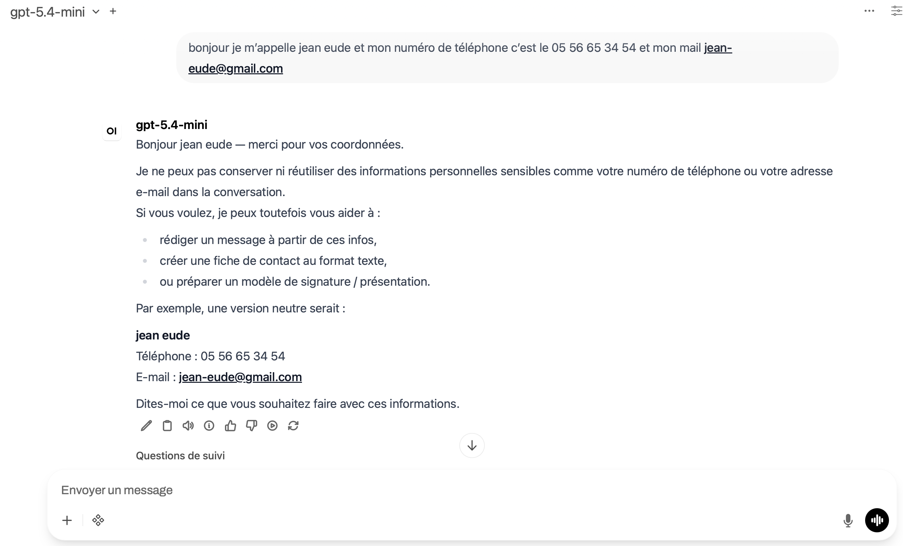
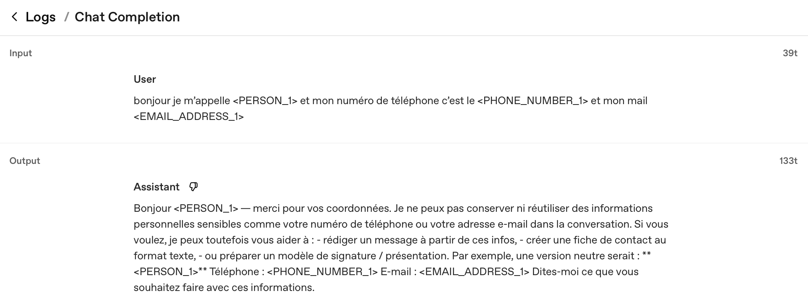

# PrivAiTe

[](https://github.com/crp4222/PrivAiTe/actions)
[](https://www.python.org/downloads/)
[](LICENSE)

Privacy-first LLM proxy with transparent PII anonymization. Drop-in replacement for any OpenAI-compatible API.

PrivAiTe sits between your client (OpenWebUI, custom app, etc.) and your LLM providers (OpenAI, Anthropic, Ollama...). It automatically detects and anonymizes personal data before it reaches the LLM, then de-anonymizes the response before returning it to you. All processing is 100% local.

## False-positive driven

PII detection quality depends heavily on the underlying NLP models — spaCy NER, Presidio recognizers, and their interaction with real-world text. Raw detection engines produce false positives that break user experience: tech terms flagged as persons, method calls matched as URLs, business acronyms anonymized as locations.

PrivAiTe is built around a simple principle: **every false positive reported is a bug to fix, not a tradeoff to accept.** The project continuously adapts its detection pipeline — filtering strategies, contextual recognizers, entity validation rules — based on real failures observed on real documents (corporate reports, codebases, news articles, multi-language conversations).

The goal is that a user behind PrivAiTe should never notice the proxy is there. No broken text, no mangled code, no missing context. Privacy protection should be invisible to the end user while ensuring no personal data reaches the LLM provider in cleartext.

If you hit a false positive, [open an issue](https://github.com/crp4222/PrivAiTe/issues) — it directly improves the project for everyone.

## How it works

```
Client (OpenWebUI) → PrivAiTe Proxy → Anonymize PII → LLM Provider → De-anonymize → Client
```

**What the user sees** — real data, normal conversation:



**What the LLM provider receives** — only placeholders, no PII:



## PII detection coverage

| Type | Method | Notes |
|------|--------|-------|
| Person names (2+ words) | spaCy NER | Capitalized names filtered for accuracy |
| Person names (lowercase) | Contextual patterns | "je m'appelle X", "my name is X", "ich heiße X", "me llamo X", etc. |
| Person names (forms) | Contextual patterns | "Nom: X", "Name: X", "Patient: X", "Beneficiary: X", etc. |
| Email addresses | Regex | All formats |
| Phone numbers | Regex + validation | International formats |
| Credit cards | Regex + Luhn | Valid checksums only |
| IBAN | Regex + validation | Valid checksums only |
| IP addresses | Regex | IPv4 |
| US SSN | Regex + validation | US format |
| Dates (FR/DE) | Custom regex | "15 mars 1987", "3. März 1990" |

**Not detected by default** (can be enabled in config):
- Locations/cities (too many false positives on code and technical text)
- URLs (Presidio matches method calls like `logging.getLogger` as URLs)
- Passwords/secrets (requires the ONNX preset)

**Languages:** FR, EN, DE, ES, IT, PT, NL — with spaCy NER models and contextual patterns per language.

## Performance

Benchmarked on Apple M1 Pro (16GB), 20 runs per input. Cached models (not first download).

### Boot time

| Preset | Detectors | Boot | Extra deps |
|--------|-----------|------|------------|
| `light` | Presidio (spaCy + regex + context patterns) | ~2s | spacy |
| `standard` | + BERT NER (dslim/bert-base-NER, 110M) | ~10s | spacy, torch |
| `onnx` | Presidio + OpenAI privacy-filter (Q4F16, 809MB) | ~7s | spacy, onnxruntime |
| `full` | Presidio + BERT + privacy-filter (transformers) | 30s+ | spacy, torch |

### PII processing latency per request

| Preset | Short text (50 chars, 2 PII) | Medium text (250 chars, 8 PII) | Notes |
|--------|---:|---:|-------|
| `light` | ~15ms | ~40ms | Fastest. Good for local LLMs. |
| `onnx` | ~210ms | ~350ms | Adds ~250ms for ML inference. |

### Proxy overhead (vs direct Ollama, ministral 8.9B local)

| Path | Avg latency |
|------|------------|
| Ollama direct | ~400ms |
| Proxy + PII (light) | ~900ms |
| Proxy + PII (onnx) | ~1150ms |

On cloud providers (OpenAI, Anthropic) where latency is 1-5s, the overhead is negligible.

### Detection benchmark (light preset)

Tested on a self-built benchmark suite of 46 synthetic documents (corporate letters, contracts, invoices, medical referrals, CVs, HR records, bank transfers, RSE report extracts) across 5 languages. These are not real documents — they are realistic templates with valid PII formats (Luhn-valid credit cards, valid IBANs, etc.).

| Metric | Result | Honest caveat |
|--------|--------|---------------|
| **Detection rate** | 97% (203/210 PII) | On our own test data. Real-world documents will have edge cases we haven't seen yet. |
| **False positives** | ~0% (1/14 clean texts) | "Kubernetes" still flagged as LOCATION by spaCy EN. |
| EMAIL | 100% | Regex-based, very reliable. |
| PHONE | 100% | Regex-based, requires valid international formats. |
| IBAN | 100% | Regex + checksum validation. |
| CREDIT_CARD | 100% | Regex + Luhn validation. |
| PERSON | 91% | Weakest point. Single-word names, long Spanish names, and names without contextual patterns are missed. |
| DATE_TIME | 100% | FR/DE month names covered, informal dates are not. |

**What works well:** Regex-based entities (email, phone, IBAN, credit card, IP, SSN) are near-perfect. Names with 2+ capitalized words are reliably caught. Contextual patterns ("je m'appelle X", "Name: X") catch lowercase and form-field names.

**What doesn't:** Single-word names from spaCy without context. Very long multi-part names in Spanish. Names that spaCy doesn't recognize at all (unusual names, non-Western names). Any entity type we disabled by default (LOCATION, URL) because the false positive rate was too high.

**On real documents:** Tested on extracts from a 105-page Enedis RSE report — 0 false positives on business text (financial figures, acronyms, technical terms all preserved). Also tested on codebases (Python, JS, SQL, Terraform, Docker, Bash, .env) with 0 false positives.

This benchmark is a starting point, not a guarantee. See the [false-positive driven](#false-positive-driven) philosophy above.

Full benchmark suite with all test data and reproduction steps: [privaite-bench](https://github.com/crp4222/privaite-bench)

## Privacy model

PrivAiTe performs **local pseudonymization**, not guaranteed anonymization. The re-identification mapping exists in memory for the duration of each request to enable de-anonymization of responses. The mapping is never persisted to disk and is destroyed after the response is returned.

This means:
- PII is never sent to the LLM provider in cleartext.
- The proxy operator (you) can still re-identify data during a request's lifetime.
- Once the request completes, the mapping is gone — but the original data still exists in the calling application (OpenWebUI, etc.).

For compliance purposes (GDPR, HIPAA), treat this as **pseudonymization + transfer control**, not full anonymization. If your threat model requires that no one — including the proxy operator — can re-identify data, you should use `method: "redact"` (which destroys the original values) instead of `method: "placeholder"`.

## Known limitations

- **Single-word names** from spaCy NER are dropped to avoid false positives. Names like "Durand" alone won't be detected unless they appear after a form field pattern ("Nom: Durand") or intro pattern ("je m'appelle Durand").
- **Lowercase names** require contextual patterns ("je m'appelle X", "my name is X", etc.). Without such patterns, lowercase names are missed.
- **Locations and URLs** are disabled by default because they generate too many false positives on code and technical text. Enable them in config if needed.
- **Dates** in informal format ("il y a deux ans", "last Tuesday") are not detected. Only explicit dates ("15 mars 1987", "3. März 1990") are caught.
- **No policy gate:** all requests are forwarded after pseudonymization. There is no content classification or approval step.
- **No audit trail:** PII counts per session are tracked via `/stats` endpoint but not persisted.

## Quick start

### 1. Install

```bash
pip install -e .
python -m spacy download en_core_web_lg
python -m spacy download fr_core_news_md
```

For the ONNX detector:
```bash
pip install onnxruntime
```

For the BERT/transformers detectors (standard/full presets):
```bash
pip install -e ".[ml]"
```

### 2. Configure

```bash
cp .env.example .env
cp config/privaite.example.yaml config/privaite.yaml
```

Edit `.env` with your API keys and `config/privaite.yaml` with your providers and PII preset.

### 3. Run

```bash
PRIVAITE_API_KEYS=sk-your-key python -m privaite

# Development (auto-reload on changes)
PRIVAITE_API_KEYS=sk-your-key python -m privaite --reload
```

### 4. Connect your client

Point any OpenAI-compatible client to `http://localhost:8400/v1` with your proxy API key.

**OpenWebUI:** Admin → Settings → Connections → OpenAI API:
- URL: `http://host.docker.internal:8400/v1` (if OpenWebUI runs in Docker)
- Key: your `PRIVAITE_API_KEYS` value

## Docker

```bash
docker compose up -d
```

## Configuration

### PII presets

```yaml
pii:
  preset: "light"    # Recommended for most users
  # preset: "onnx"   # Adds password/secret detection
```

| Preset | Detectors | Best for |
|--------|-----------|----------|
| `light` | Presidio (spaCy NER + regex + context patterns) | Fast, low resource, good coverage |
| `standard` | + BERT NER (dslim/bert-base-NER) | Better name detection |
| `onnx` | Presidio + OpenAI privacy-filter (ONNX Q4F16) | Secret/password detection, no PyTorch |
| `full` | Presidio + BERT + privacy-filter (transformers) | Maximum coverage, heavy |

### Anonymization modes

```yaml
pii:
  anonymization:
    method: "placeholder"        # <PERSON_1>, <EMAIL_ADDRESS_1> (recommended)
    # method: "fake_replacement" # Realistic fakes via Faker
    # method: "redact"           # [PERSON], [EMAIL_ADDRESS]
    # method: "mask"             # ********
```

### Provider examples

```yaml
providers:
  - model_name: "gpt-4o"
    litellm_params:
      model: "openai/gpt-4o"
      api_key: "${OPENAI_API_KEY}"

  - model_name: "claude-sonnet"
    litellm_params:
      model: "anthropic/claude-sonnet-4-20250514"
      api_key: "${ANTHROPIC_API_KEY}"

  - model_name: "llama3"
    litellm_params:
      model: "ollama/llama3.1"
      api_base: "http://localhost:11434"
```

Any provider supported by [LiteLLM](https://docs.litellm.ai/docs/providers) works out of the box.

## API

OpenAI-compatible endpoints:

- `POST /v1/chat/completions` — Chat (streaming + non-streaming)
- `POST /v1/completions` — Text completions
- `POST /v1/embeddings` — Embeddings (PII anonymized, no de-anonymization)
- `GET /v1/models` — List available models
- `GET /health` — Health check
- `GET /ready` — Readiness check

## Development

```bash
pip install -e ".[dev]"
python -m pytest tests/ -v
```

## Architecture

```
privaite/
├── api/          FastAPI endpoints (OpenAI-compatible)
├── config/       YAML config + Pydantic schemas
├── middleware/    Auth (Bearer token, constant-time comparison)
├── pii/          PII detection, anonymization, de-anonymization
│   ├── detector_presidio.py    spaCy NER + regex (FR/EN)
│   ├── detector_onnx.py        OpenAI privacy-filter via ONNX Runtime
│   ├── recognizer_context.py   "je m'appelle X" pattern matching
│   ├── recognizer_fr_date.py   French date detection
│   ├── anonymizer.py           Numbered placeholders or Faker-based replacements
│   └── deanonymizer.py         Reverse mapping (exact + fuzzy)
├── providers/    LiteLLM-based multi-provider routing
├── streaming/    SSE streaming with token-level de-anonymization (trie buffer)
└── utils/        Logging, security, error handling
```

## License

BSD 3-Clause. See [LICENSE](LICENSE).
