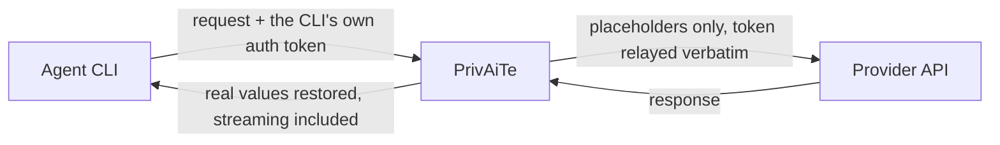

# PrivAiTe

Self-hosted PII redaction proxy for LLM APIs.

[](https://github.com/crp4222/PrivAiTe/actions)
[](https://www.python.org/downloads/)
[](LICENSE)
[](https://pypi.org/project/privaite/)

**A drop-in LLM proxy that reversibly replaces PII before it reaches the provider, including inside tool-call arguments and multimodal content, with zero telemetry.**

```
You type: "Je m'appelle Marie Dupont, email marie@acme.com"
LLM sees: "Je m'appelle <PERSON_1>, email <EMAIL_ADDRESS_1>"
LLM says: "Bonjour <PERSON_1>, votre email <EMAIL_ADDRESS_1> est noté."
You  see: "Bonjour Marie Dupont, votre email marie@acme.com est noté."
```

PrivAiTe sits between your app and the model provider. It finds names, emails, phones, cards, IBANs, secrets and more, swaps them for stand-ins before anything leaves your machine, and puts the real values back in the reply. Most tools scan only the plain message text; agent traffic hides PII inside tool-call JSON, and that is the gap PrivAiTe closes. Detection runs locally ([two engines](docs/detection.md), Presidio + OpenAI's open privacy-filter model), and the engine runs three ways: standalone proxy, [Open WebUI filter, or LiteLLM guardrail](#integrations).

This is local pseudonymization, not anonymization, and detection is best-effort rather than a guarantee. You remain the data controller. The [Threat model](#threat-model) spells out exactly what it protects against and what it does not.

## Quick start

**Docker (fastest):** the detection model is baked in, so it runs offline from the first request.

```bash
docker run -d -p 8400:8400 \
  -e PRIVAITE_API_KEYS=change-me \
  -e OPENAI_API_KEY=sk-... \
  ghcr.io/crp4222/privaite
```

The same image is on Docker Hub too: swap the last line for `crp4222/privaite` if you prefer pulling from there.

Two keys, two roles: `PRIVAITE_API_KEYS` is the key your client sends to PrivAiTe (pick any value); `OPENAI_API_KEY` is your real provider key, which stays in the container and never reaches your client. This exposes `gpt-4o-mini` and `gpt-4o`; for any other provider (Ollama, Azure, anything LiteLLM supports), mount a config: [configuration](docs/configuration.md#docker-with-a-custom-config).

**pip:**

```bash
pip install privaite
# One spaCy model per scanned language; the default preset scans EN + FR.
python -m spacy download en_core_web_lg && python -m spacy download fr_core_news_md

cat > privaite.yaml <<'EOF'
providers:
  - model_name: gpt-4o-mini
    litellm_params:
      model: openai/gpt-4o-mini
      api_key: ${OPENAI_API_KEY}
pii:
  enabled: true
  preset: onnx    # or "light": faster, no model download, classic PII only
EOF

PRIVAITE_API_KEYS=change-me python -m privaite --config privaite.yaml
```

**Connect:** point any OpenAI-compatible client at `http://localhost:8400/v1` with the key `change-me`. For Open WebUI: Admin → Settings → Connections → OpenAI API, URL `http://localhost:8400/v1` (or `http://host.docker.internal:8400/v1` if Open WebUI runs in Docker), key = your `PRIVAITE_API_KEYS` value. Client snippets (curl, Python, Node) are in [`examples/`](examples/). Prefer no separate proxy? Use the in-process [Open WebUI filter](#integrations).

## Use it with Claude Code (agent CLI gateway)

Opt-in gateway mode (off by default): your agent CLI points its base URL at PrivAiTe, which scrubs PII and secrets out of each request (tool-call arguments included) with the same local, benchmarked detection, relays whatever auth the CLI itself sends verbatim upstream, and restores the real values in the response, streaming included. The Claude Code path (Anthropic Messages API) is validated live end to end: running against the real Anthropic API with restore disabled proved the provider only ever received placeholders. Codex support is beta (see below). Any OpenAI-compatible app already works through the standard proxy above; the gateway adds the native protocols these CLIs speak.



```yaml
gateway:
  enabled: true
  anthropic:
    base_url: "https://api.anthropic.com/v1"
pii:
  detection_cache:
    enabled: true    # recommended for agent sessions, see below
```

```bash
ANTHROPIC_BASE_URL=http://localhost:8400 claude
```

Enable the detection cache when you use the gateway: agent CLIs resend the whole conversation every turn, and without the cache every turn re-scans the entire history (roughly 50 seconds per turn on a large measured session, about a second with the cache on). The [threat model](#threat-model) spells out the memory tradeoff.

**Codex (beta).** The gateway also exposes `/v1/responses` (OpenAI Responses API), which is what Codex speaks. That path passes the same test suite but has had less live validation than Claude Code, so it is labeled beta; setup is in [docs/gateway.md](docs/gateway.md#codex-beta).

Four things to know before relying on it:

- **Measured, not promised.** In the [live agent-workflow benchmark](https://github.com/crp4222/privaite-bench/blob/main/agent_workflow/RESULTS.md), Claude Code reading a repository with 24 planted PII values and secrets sent all 24 to the provider directly; through the gateway with the default preset, 0 reached it on that fixture, and on a larger realistic session 2 of 24 still got through (two secrets embedded in log lines). Never read this as zero leaks.
- **It protects the egress, not the agent.** Claude Code and Codex still hold the real values in their own context and local transcripts; only what reaches the provider is scrubbed.
- **The agent's own prompt is deliberately not scanned.** The Anthropic `system` field and the Responses `instructions` field pass through as-is, and Claude Code injects your `CLAUDE.md` and project context there.
- **Auth is relayed, not managed.** PrivAiTe injects and validates nothing on gateway routes; it forwards the credentials your CLI sends, for your own traffic. Whether your provider's terms of service permit that traffic to transit a local proxy is between you and the provider; this is not a provider-supported integration, and API-key mode is the durable path.

Full setup, the flow diagram in detail, scanned surface and limits: [docs/gateway.md](docs/gateway.md).

## Benchmark

Measured on 120 real documents from the open [AI4Privacy `pii-masking-200k`](https://huggingface.co/datasets/ai4privacy/pii-masking-200k) dataset (458 PII items, labeled by 10 independent auditor agents and cross-checked against the dataset's own mask) across DE, EN, FR, IT, plus 14 clean documents for false positives.

| Solution | Recall (span) | Recall (strict) | False positives | Tool-call protection |
|---|---|---|---|---|
| `onnx` (default) | **84.5%** | **80.6%** | 2 / 14 | **100%** |
| `light` (full Presidio) | 62.4% | 57.9% | 3 / 14 | **100%** |
| LiteLLM Presidio guardrail | 70.3% | 65.3% | 3 / 14 | 0.0% |
| LLM Guard (Anonymize) | 76.9% | 74.9% | 5 / 14 | 0.0% |

Read the 100% precisely, it is structural, not absolute: of the PII PrivAiTe detects in plain text, 100% is also removed from tool-call JSON. End to end, its tool-call leak equals its detection misses (15.5% on this corpus with the `onnx` preset), the same misses flat text has.

Two honesty notes, both favoring caution. LLM Guard's detection model is fine-tuned on the exact dataset behind this corpus, so its recall here is optimistic; PrivAiTe's default model is not (OpenAI's model card states it did not train on it). An out-of-distribution cross-check on two independent corpora confirms the default generalizes: ~84% held on Gretel finance text while the AI4Privacy-tuned model drops to ~62% ([OOD_COMPARISON.md](https://github.com/crp4222/privaite-bench/blob/main/OOD_COMPARISON.md)).

Per-language and per-entity tables, competitor configs, methodology, reproduction: [privaite-bench](https://github.com/crp4222/privaite-bench). Feature comparison: [docs/comparison.md](docs/comparison.md).

There is also a live agent-workflow benchmark: a repository with 24 planted PII values and secrets, driven through real Claude Code and Codex sessions, with a recording proxy measuring what actually reaches the provider. Directly, Claude Code sent 24/24 planted values and Codex 20/24. Through the [gateway](docs/gateway.md) with the default `onnx` preset, 0/24 reached the provider on that fixture; on a larger realistic session, 2 of 24 still got through (two secrets embedded in log lines), so treat it as a strong measured reduction, not zero leaks. Full matrix, latency and cache measurements: [agent_workflow/RESULTS.md](https://github.com/crp4222/privaite-bench/blob/main/agent_workflow/RESULTS.md).

## Presets

| Preset | What runs | Recall\* | False positives | Latency | Secrets |
|--------|-----------|----------|-----------------|---------|---------|
| `onnx` (default) | Presidio + Privacy Filter | **84.5%** | 2 / 14 | ~0.5s | **yes** |
| `light` | Presidio only | 62.4% | 3 / 14 | ~60ms | no |
| `max` | onnx + GLiNER | higher OOD | more | ~0.7s | **yes** |

\*Span recall on the AI4Privacy benchmark above. `max` adds GLiNER (trained on data independent of AI4Privacy): on out-of-distribution corpora it raises recall by several points at the cost of more false positives and a torch dependency (`pip install 'privaite[gliner]'`); with it selected but not installed, the proxy fails at startup with an install hint rather than silently degrading.

**`onnx`** = maximum coverage: secrets, passwords, API keys, unusual names, addresses. **`light`** = fastest, near-zero false positives, classic PII only, no addresses/URLs/secrets. How the engines work and what stays off by default: [docs/detection.md](docs/detection.md).

> **Footgun:** do not pin `detectors.presidio.entities` to a short allowlist on the `light` path. It restricts detection to only those types and roughly halves recall (to ~35%). Leave `entities` unset; the proxy logs a warning at startup if it detects a low-recall configuration.

## What it scans

Before anything is forwarded: `messages[].content` (plain string or multimodal text parts), `tool_calls[].function.arguments` and the legacy `function_call.arguments` (parsed as JSON, scrubbed value by value including bare numeric leaves, keys and function names intact), `/v1/completions` `prompt` and `suffix`, `/v1/embeddings` `input`, chat `prediction.content` (predicted outputs) and `web_search_options.user_location`. On the way back, values are restored in content, tool calls, reasoning traces, refusals and audio transcripts, streaming included.

NOT scanned (know your surface): `messages[].name`, top-level `user`/`metadata`, `tools` definitions, JSON object keys. Keep PII out of those fields. Endpoints, strict mode and passthrough caveats: [docs/api.md](docs/api.md).

## Threat model

PrivAiTe performs **local pseudonymization**, not guaranteed anonymization. Detection runs on your machine; the real ↔ placeholder mapping lives in memory only for the duration of a request and is dropped afterwards.

**What it protects against:** the LLM provider storing, training on, or logging your raw PII. The provider receives placeholders (`<PERSON_1>`, …) for everything the detector catches, across message content, tool-call arguments, and multimodal text.

**What it does NOT protect against:**

- **PII the detector misses.** Detection is statistical and never 100% (see the [benchmark](#benchmark)). A name it doesn't recognize reaches the provider. Treat the output as best-effort, not a guarantee.
- **Re-identification from context.** Even with names replaced, the surrounding text can stay identifying ("the CEO of `<ORG_1>` who resigned in March").
- **A compromised local machine.** The mapping and raw text live in local memory; this is not a defense against a local attacker.
- **The provider correlating** requests within a session.
- **The agent itself, in [gateway mode](docs/gateway.md).** The CLI keeps the real values in its own context and local transcripts; only the traffic to the provider is scrubbed. And the agent's own prompt (the Anthropic `system` field, the Responses `instructions` field) is relayed unscanned, so PII in your `CLAUDE.md` or injected project context reaches the provider.

**If you enable the detection cache** (`pii.detection_cache`, off by default), one nuance is added to the promise above. The reversible mapping is still per-request and still dropped when the request ends. But the cache keeps PII-derived **metadata** in process memory for up to its TTL (default 30 minutes) after a request ends: salted BLAKE2b hashes of recently scanned text fragments, plus the positions, types, scores and detector sources of the PII spans found in them. An expired entry is never served again; it is removed from memory on the first cache write after its expiry, and the whole cache is cleared at shutdown, so only a process that goes completely idle keeps its last (expired, unusable) entries longer, until that next write or shutdown. No text, no PII values, no anonymized output, and nothing on disk. The honest delta: an attacker who can already read process memory (who today sees every in-flight request and its full mapping) additionally gains, for up to the TTL after traffic stops (longer only in the idle-process case above), (a) confirmation that a specific candidate text was recently processed, since the hash salt sits in the same memory, and (b) the positions and types of PII inside documents they obtained elsewhere. They gain no raw values and no ability to reverse placeholders. In multi-user deployments there is also a dedup timing side channel: the cache is shared across auth keys, and a cache hit is observably faster than a miss, so one user can in principle probe whether an exact text was recently sent by another. Leave the cache off if any of this matters for your deployment; enable it for [agent CLI sessions](docs/gateway.md), where it removes the cost of re-scanning the entire resent conversation on every turn.

For GDPR/HIPAA: treat this as pseudonymization + transfer minimization, not anonymization. If you need irreversible removal, use `method: "redact"`. Audit it on your own data: [docs/verify.md](docs/verify.md).

## Alternatives

Keeping PII out of LLM calls is a crowded space, and PrivAiTe is not always the right pick. Based on each project's public docs as of June 2026:

- LiteLLM has a built-in Presidio guardrail, the natural choice if you already run the LiteLLM proxy and want PII handling inline (there are a few open bugs around scrubbing requests and responses).
- Managed/cloud options exist too, such as Microsoft PII Shield and [LangChain's gateway redaction](https://docs.langchain.com/langsmith/llm-gateway-redaction).

Where PrivAiTe differs: it anonymizes PII **inside tool-call arguments and multimodal content**, not just message text (LangChain's gateway docs, for instance, note that tool-call arguments are not scanned), it **restores** the original values in the response, and it ships a [reproducible benchmark](https://github.com/crp4222/privaite-bench). If your traffic is agentic or multimodal, that gap is the reason this exists.

## Integrations

- **Open WebUI filter** ([setup](integrations/openwebui/README.md), [hub listing](https://openwebui.com/posts/privaite_pii_anonymizer_351aa088)): an Open WebUI Filter Function running the engine in-process, no separate proxy. Admin Panel → Functions → paste `integrations/openwebui/privaite_filter.py`, enable, pick preset and languages in its valves. Covers message text, tool calls and multimodal.
- **LiteLLM guardrail** ([setup](integrations/litellm/README.md)): a custom guardrail for teams already on the LiteLLM proxy. Mount `integrations/litellm/privaite_guardrail.py` next to your `config.yaml` to anonymize requests and restore responses inline, including tool-call arguments, which LiteLLM's built-in Presidio guardrail does not scan.

## Docs

Also browsable as a site: [crp4222.github.io/PrivAiTe](https://crp4222.github.io/PrivAiTe/).

- [How detection works](docs/detection.md): the two engines, what each catches, what stays off by default, known limitations
- [Configuration reference](docs/configuration.md): providers, Docker with custom config, anonymization methods, `block_entities`, custom patterns, languages, pinned model revisions
- [API reference](docs/api.md): endpoints, the exact scanned/unscanned surface, strict mode, passthrough caveats
- [Verify what gets redacted](docs/verify.md): audit the proxy on your own data, dry-run inspect endpoint
- [Feature comparison](docs/comparison.md) and the [reproducible benchmark](https://github.com/crp4222/privaite-bench)
- [Agent CLI gateway](docs/gateway.md): Claude Code setup, Codex setup (beta), what gateway routes scan, honest limits
- [Changelog](CHANGELOG.md)

## Development

```bash
git clone https://github.com/crp4222/PrivAiTe && cd PrivAiTe
pip install -e ".[dev]"
python -m spacy download en_core_web_lg && python -m spacy download fr_core_news_md

cp .env.example .env                                    # keys
cp config/privaite.example.yaml config/privaite.yaml    # providers
python -m privaite --reload                             # dev mode (auto-reload)

python -m pytest tests/ -v
```

## License

BSD 3-Clause. See [LICENSE](LICENSE).
