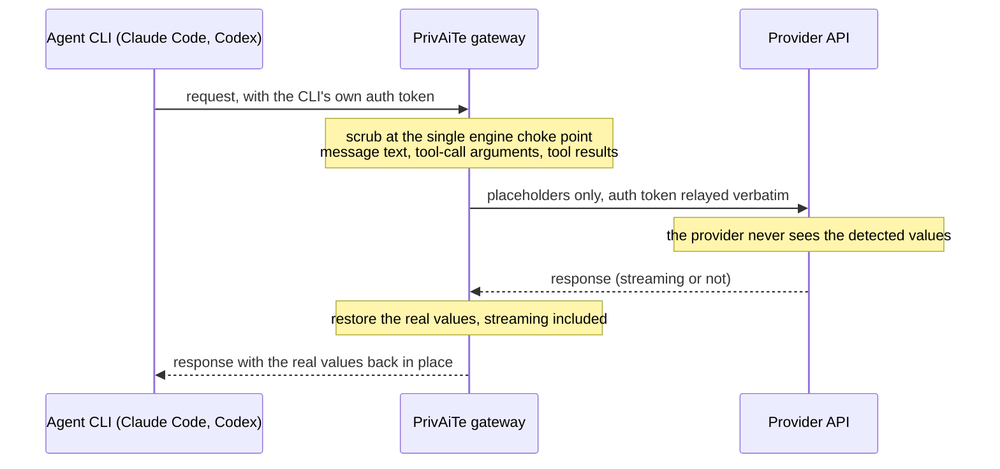

# Agent CLI gateway (Claude Code, Codex in beta)

Gateway mode lets an agent CLI point its base URL at PrivAiTe. On the way out,
the request is scrubbed by the same engine and presets as the OpenAI-compatible
endpoints, tool-call arguments included, and whatever auth the CLI itself sends
is relayed verbatim upstream. On the way back, the real values are restored,
streaming included. It is opt-in and off by default: with `gateway.enabled:
false` the routes do not exist and nothing about the proxy changes.

**Status.** The Claude Code path (Anthropic Messages API: `/v1/messages` and
`/v1/messages/count_tokens`) is the validated path: it was exercised live end
to end against the real Anthropic API, and running with restore disabled proved
the provider only ever received placeholders, restore and streaming included.
The Codex path (OpenAI Responses API: `/v1/responses`) is **beta**: it passes
the same test suite, but the Responses protocol has more moving parts and this
path has had less live validation than Claude Code. Expect rough edges and
please report what you hit.

## How a request flows



Gateway routes carry the client's own provider credentials: PrivAiTe neither
injects nor validates any key there (`PRIVAITE_API_KEYS` applies to the
OpenAI-compatible endpoints only). The mapping between real values and
placeholders lives in memory for the length of the request, on your machine.

## Enable it

```yaml
gateway:
  enabled: true
  anthropic:
    base_url: "https://api.anthropic.com/v1"
  openai_responses:                                         # beta (Codex)
    base_url: "https://api.openai.com/v1"                   # API-key mode
    # base_url: "https://chatgpt.com/backend-api/codex"     # Codex subscription login
```

**Enable the detection cache for agent sessions.** Agent CLIs resend the whole
conversation every turn, so without the cache every turn re-scans the entire
history and the scrub cost grows with the context: on a large measured session
it reached roughly 50 seconds per turn, versus about a second with the cache
on. The tradeoff (PII-derived metadata, never values, staying in process memory
up to the TTL) is spelled out in the
[README threat model](https://github.com/crp4222/PrivAiTe#threat-model); config
details in the
[configuration reference](configuration.md#detection-cache-agent-sessions).

```yaml
pii:
  detection_cache:
    enabled: true
```

## Claude Code

```bash
ANTHROPIC_BASE_URL=http://localhost:8400 claude
```

That is the whole setup. Claude Code sends its own login with each request; the
gateway relays it as-is to `gateway.anthropic.base_url`.

## Codex (beta)

Codex only speaks the Responses API, and the `/v1/responses` route is the beta
part of the gateway (see the status note above). Add a custom provider to
`~/.codex/config.toml`:

```toml
model_provider = "privaite"

[model_providers.privaite]
name = "PrivAiTe"                # PrivAiTe Responses support is beta
base_url = "http://localhost:8400/v1"
wire_api = "responses"
requires_openai_auth = true      # Codex login relayed as-is
# env_key = "OPENAI_API_KEY"     # API-key mode instead: use this line, drop requires_openai_auth
```

With `requires_openai_auth`, also set the gateway upstream to the backend Codex
actually talks to (`https://chatgpt.com/backend-api/codex`, commented in the
YAML above). For API-key mode, keep the default `https://api.openai.com/v1`;
that is the durable, documented upstream.

## What is scanned (and what is not)

**Anthropic Messages:** `messages[]` string content, `text` blocks, `tool_use`
input (the tool-call-argument leak), `server_tool_use` and `mcp_tool_use`
input (restored client-side on one turn, echoed back on the next), `tool_result`
and `mcp_tool_result` content, `document` blocks with a text or content source,
and `search_result` blocks. Not scanned: the `system` field,
`tools`/`tool_choice` definitions, `thinking` and `redacted_thinking` blocks
(Anthropic rejects modified thinking blocks echoed back on a later turn, so
they pass through untouched in both directions), and binary media (images,
base64/url/file document sources).

**OpenAI Responses (beta):** `input`, as a string or item by item: role message
content, `function_call` arguments (parsed as JSON, scrubbed value by value),
`function_call_output`, other text-bearing item fields, bare strings. Not
scanned: the top-level `instructions` field and `tools` definitions.

The unscanned `system` and `instructions` fields matter in practice: they are
the agent's own prompt, and Claude Code injects your `CLAUDE.md` and project
context there, so PII inside those reaches the provider. Keep secrets and
personal data out of them.

Restore covers both streaming and non-streaming responses. The same fail-closed
policy applies: if scrubbing fails, the request is rejected and nothing is
forwarded.

## Measured, not promised

The [agent-workflow benchmark](https://github.com/crp4222/privaite-bench/blob/main/agent_workflow/RESULTS.md)
drives real Claude Code and Codex sessions over a repository with 24 planted
PII values and secrets and records every byte the provider actually receives.
Directly, Claude Code sent 24/24 planted values to the provider and Codex
20/24. Through the gateway with the default `onnx` preset, 0/24 reached the
provider on that fixture; on a larger, more realistic session, 2 of 24 still
got through (two secrets embedded in log lines). Read that as a strong
measured reduction, never as zero leaks: detection is statistical, and a value
it misses reaches the provider. The results page also carries the latency and
cache measurements behind the recommendation above.

## Honest limits

- **The gateway protects the egress, not the agent.** Claude Code and Codex
  still hold the real values in their own context and local transcripts; only
  what reaches the provider is scrubbed. Keeping values out of the agent's own
  context would take a source-side interceptor, which a gateway is not.
- **Auth is relayed, not managed.** The gateway forwards whatever credentials
  the CLI sends, unchanged, for your own traffic. Whether your provider's terms
  of service permit that traffic to transit a local proxy is between you and
  the provider: this is not a provider-supported or provider-endorsed
  integration, the `chatgpt.com` Codex backend is undocumented and could change
  without notice, and API-key mode is the durable path.
- Everything in the README
  [threat model](https://github.com/crp4222/PrivAiTe#threat-model) still
  applies: this is pseudonymization, not anonymization, and detection is
  best-effort.
