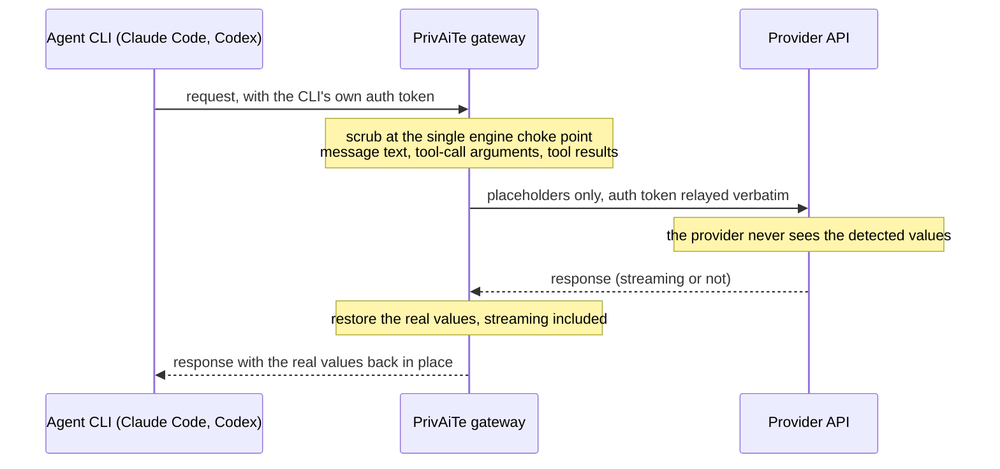

# Agent CLI gateway (Claude Code, Codex in beta)

Gateway mode lets an agent CLI point its base URL at PrivAiTe. On the way out,
the request is scrubbed by the same engine and presets as the OpenAI-compatible
endpoints, tool-call arguments included, and whatever auth the CLI itself sends
is relayed verbatim upstream. On the way back, the real values are restored,
streaming included. It is opt-in and off by default: with `gateway.enabled:
false` the routes do not exist and nothing about the proxy changes.

**Status.** The Claude Code path (Anthropic Messages API: `/v1/messages` and
`/v1/messages/count_tokens`) is the validated path: it was exercised live end
to end against the real Anthropic API, and running with restore disabled proved
the provider only ever received placeholders, restore and streaming included.
The Codex path (OpenAI Responses API: `/v1/responses`) is **beta**: it passes
the same test suite, but the Responses protocol has more moving parts and this
path has had less live validation than Claude Code. Expect rough edges and
please report what you hit.

## How a request flows



Gateway routes carry the client's own provider credentials: PrivAiTe neither
injects nor validates any key there (`PRIVAITE_API_KEYS` applies to the
OpenAI-compatible endpoints only). The mapping between real values and
placeholders lives in memory for the length of the request, on your machine.

**The gateway routes are unauthenticated, by design. Know what that means.**
With `gateway.enabled: true`, `POST /v1/messages`, `POST /v1/messages/count_tokens`
and `POST /v1/responses` accept a request that carries no PrivAiTe key at all:
the auth middleware skips exactly those paths, because the only credential in
that request is the CLI's own upstream token and there is no PrivAiTe key in it
to verify. On top of that the server binds `0.0.0.0` by default (`server.host`)
and applies no rate limit of any kind (the only inbound guard is
`server.max_request_bytes`). So an exposed port plus gateway mode is an endpoint
that anyone who can reach it can drive, spending your provider quota and being
billed to whatever account the relayed token belongs to. Set
`server.host: "127.0.0.1"`, or keep the port off untrusted networks, before
enabling gateway mode anywhere but localhost.

## Enable it

```yaml
gateway:
  enabled: true
  anthropic:
    base_url: "https://api.anthropic.com/v1"
  openai_responses:                                         # beta (Codex)
    base_url: "https://api.openai.com/v1"                   # API-key mode
    # base_url: "https://chatgpt.com/backend-api/codex"     # Codex subscription login
```

**Enable the detection cache for agent sessions.** Agent CLIs resend the whole
conversation every turn, so without the cache every turn re-scans the entire
history and the scrub cost grows with the context: on a large measured session
the per-request scrub peaked at 42 s with Claude Code and 72 s with Codex,
against a median of 1 to 3 s with the cache on. The tradeoff (PII-derived metadata, never values, staying in process memory
up to the TTL) is spelled out in the
[README threat model](https://github.com/crp4222/PrivAiTe#threat-model); config
details in the
[configuration reference](configuration.md#detection-cache-agent-sessions).

```yaml
pii:
  detection_cache:
    enabled: true
```

## Claude Code

```bash
ANTHROPIC_BASE_URL=http://localhost:8400 claude
```

That is the whole setup. Claude Code sends its own login with each request; the
gateway relays it as-is to `gateway.anthropic.base_url`.

## Codex (beta)

Codex only speaks the Responses API, and the `/v1/responses` route is the beta
part of the gateway (see the status note above). Add a custom provider to
`~/.codex/config.toml`:

```toml
model_provider = "privaite"

[model_providers.privaite]
name = "PrivAiTe"                # PrivAiTe Responses support is beta
base_url = "http://localhost:8400/v1"
wire_api = "responses"
requires_openai_auth = true      # Codex login relayed as-is
# env_key = "OPENAI_API_KEY"     # API-key mode instead: use this line, drop requires_openai_auth
```

With `requires_openai_auth`, also set the gateway upstream to the backend Codex
actually talks to (`https://chatgpt.com/backend-api/codex`, commented in the
YAML above). For API-key mode, keep the default `https://api.openai.com/v1`;
that is the durable, documented upstream.

## What is scanned (and what is not)

**Anthropic Messages.** Scanned: `messages[]` content when it is a plain
string; `text` blocks; `tool_use` input (the tool-call-argument leak) and the
`server_tool_use` / `mcp_tool_use` input the client echoes back after a restore;
`tool_result` and `mcp_tool_result` content (a bare string, a nested block, or a
list of both); `document` blocks (`title`, `context`, and a `text` or `content`
source); `search_result` blocks (`title`, `source`, `content`). A block type
this build does not know is **also** scanned rather than relayed raw: its
allowlisted plaintext fields go through the engine, its `input`/`output` payload
is walked leaf by leaf, and its `content` and a dict `source` follow the same
rules as a known block. Not scanned: the `system` field (relayed verbatim, see
below), `tools`/`tool_choice` definitions, and JSON object keys. Relayed
byte-for-byte: `thinking` and `redacted_thinking` blocks (Anthropic rejects
modified thinking blocks echoed back on a later turn, so they pass through
untouched in both directions), the binary/pointer blocks, base64/url/file
document sources, and on an unknown block everything outside the allowlist (a
`source.data` blob, a `signature`, `encrypted_content`, ids).

**OpenAI Responses (beta).** Scanned: `input` as a plain string, or item by
item: the `content` of an item that carries both a `role` and a `content`
(including the `text` and `refusal` fields of its parts, and bare strings in the
part list); `function_call` `arguments` (parsed as JSON, scrubbed value by value,
re-encoded); `custom_tool_call` `input`; the typed data field of a typed item;
the `output` of any `*_output` item (this is where a file the agent read comes
back, walked leaf by leaf); the text-bearing fields (`output`, `arguments`,
`input`, `text`, `reason`) and the `content` of an item shape this build does not
know; bare strings in the `input` list; and `prompt.variables` (the prompt
template's own `id` and `version` are not user text and are left alone). Not
scanned: the top-level `instructions` field (relayed verbatim, see below),
`tools` definitions, and JSON object keys. Relayed byte-for-byte: the opaque
item types (encrypted reasoning and compaction, generated images, server-side
pointers, tool listings) and the binary content/output parts.

### Exact lists (pinned to the code by a test)

These are the frozensets the scrubber actually uses; `tests/test_gateway/test_gateway_docs.py`
fails if this page and the code drift apart, in either direction.

- Anthropic blocks relayed byte-for-byte: `thinking`, `redacted_thinking`, `image`, `container_upload`
- Anthropic tool blocks scanned: `tool_use`, `server_tool_use`, `mcp_tool_use`, `tool_result`, `mcp_tool_result`
- Unknown Anthropic block, plaintext fields scanned: `text`, `title`, `context`, `source`, `url`, `reason`, `stdout`, `stderr`
- Unknown Anthropic block, JSON payload fields walked: `input`, `output`
- Responses items relayed byte-for-byte: `reasoning`, `compaction`, `compaction_trigger`, `computer_call_output`, `image_generation_call`, `item_reference`, `mcp_list_tools`, `tool_search_call`, `tool_search_output`, `additional_tools`
- Responses typed item fields scanned: `computer_call.action`, `computer_call.actions`, `local_shell_call.action`, `shell_call.action`, `web_search_call.action`, `apply_patch_call.operation`, `file_search_call.queries`, `file_search_call.results`, `code_interpreter_call.code`, `code_interpreter_call.outputs`, `program.code`, `program_output.result`
- Responses content and output parts relayed byte-for-byte: `input_image`, `input_file`, `input_audio`, `image`, `output_image`, `computer_screenshot`

The unscanned `system` and `instructions` fields matter in practice: they are
the agent's own prompt, and Claude Code injects your `CLAUDE.md` and project
context there, so PII inside those reaches the provider. Keep secrets and
personal data out of them. They are read for policy even so: both go through the
same `block_entities` gate, so a blocked type sitting in the agent's prompt
rejects the request instead of being relayed.

Restore covers both streaming and non-streaming responses. The same fail-closed
policy applies: if scrubbing fails, the request is rejected and nothing is
forwarded.

## Measured, not promised

The [agent-workflow benchmark](https://github.com/crp4222/privaite-bench/blob/main/agent_workflow/RESULTS.md)
drives real Claude Code and Codex sessions over a repository with 24 planted
PII values and secrets and records every byte the provider actually receives.
Directly, Claude Code sent 24/24 planted values to the provider and Codex
20/24. Through the gateway with the default `onnx` preset, 0/24 reached the
provider on that fixture; on a larger, more realistic session, 2 of 24 still
got through. Both are secrets in `key=value` log lines, and the mechanism is
now measured rather than guessed. It is a detection miss, not a routing bug:
the gateway traversed and scrubbed those exact lines (they arrive at the
provider with `<DATE_TIME_n>` placeholders already substituted into them), the
detector simply did not flag the two values.

What the miss actually depends on is surrounding context, not input size:

- On their own, both values are caught: in `.env` assignment form and on an
  isolated log line, they are scrubbed every time.
- Roughly **one preceding line of log-shaped context is enough to break it**. A
  7-line, ~1 KB excerpt of that same log already reproduces the miss: the API
  key survives all 5 of its occurrences there, the SMTP password 4 of 5.
  41-line windows leak 4 of 5 and 3 of 5.
- The effect is **order dependent**: text appended *after* the line never
  triggers it. Only text in front of the value does.
- Because this is a property of the detector and not of the gateway, it applies
  to **every surface that runs the engine**: the OpenAI-compatible proxy, the
  Open WebUI filter and the LiteLLM guardrail leak the same values on the same
  input. Nothing about this is gateway-specific.

It lands where the benchmark already says the detector is weakest (SECRET
recall 71.4% on the comparison corpus). Read the 2 of 24 as a strong measured
reduction, never as zero leaks, and read it as a floor rather than a ceiling:
one of the four database-URL password occurrences is held back only by a
Presidio `EMAIL_ADDRESS` false positive scoring 1.0 over the URI userinfo, so
that password is currently typed and placeholdered as an email (and therefore
reversible) rather than redacted as a secret. The results page also carries the
latency and cache measurements behind the recommendation above.

## Known behaviors (from live validation)

Observed in real Claude Code and Codex sessions through the gateway. These are
fidelity notes and beta edges, not leaks: in each case the real values stayed
on the machine.

- **The model may confabulate scrubbed values.** The model only ever sees
  placeholders, so it sometimes invents a plausible stand-in in its prose (a
  name, an env var name). The invention is silent: if a reply states a
  concrete value the model could not have seen, treat it as made up.
- **Absolute file paths can be scrubbed as URLs.** A path inside tool-call
  input may be replaced by a URL placeholder, so the provider sees a mangled
  path in the echoed tool history. The local tool loop keeps working on the
  real path; only the model's view of the path degrades.
- **Codex (beta) rough edges.** Codex's model refresh calls `/v1/models` on
  the gateway and a red ERROR line is logged on every run; it is noise, not a
  failure. A detection span can also swallow an adjacent label or newline, so
  a faithful restore reproduces a small cosmetic formatting artifact in the
  displayed output.

## Honest limits

- **The gateway protects the egress, not the agent.** Claude Code and Codex
  still hold the real values in their own context and local transcripts; only
  what reaches the provider is scrubbed. Keeping values out of the agent's own
  context would take a source-side interceptor, which a gateway is not.
- **Auth is relayed, not managed.** The gateway forwards whatever credentials
  the CLI sends, unchanged, for your own traffic, and the gateway routes
  themselves accept no PrivAiTe key (see [How a request flows](#how-a-request-flows):
  open routes, `0.0.0.0` bind, no rate limit). Whether your provider's terms
  of service permit that traffic to transit a local proxy is between you and
  the provider: this is not a provider-supported or provider-endorsed
  integration, the `chatgpt.com` Codex backend is undocumented and could change
  without notice, and API-key mode is the durable path.
- Everything in the README
  [threat model](https://github.com/crp4222/PrivAiTe#threat-model) still
  applies: this is pseudonymization, not anonymization, and detection is
  best-effort.
